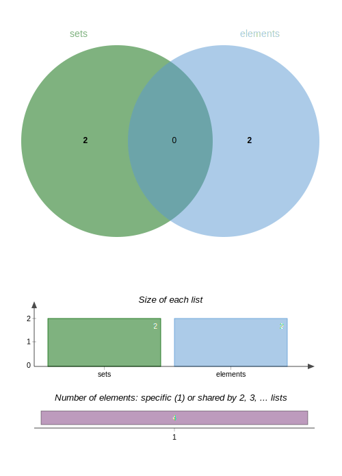

# 书籍信息:
|名称      |作者        |编号                   |
|:---      |:---        |:---                  |
|语言学概论|陈保亚 杜兆金|ISBN 978-7-301-33972-5|

# 定义
|        |       |
|:--------|:-------|
| 语言 |语言是由特定的语音、词汇、语法构成的符号系统。     |
| 符号 |符号是用以指称事物或表达抽象观念的有意义的记号或标记。|
| 语言符号 |语言符号是用以指称事物或表达抽象观念的音义结合体。|
| 语音 |(自然语言的)语音是由人的发音器官发出的有意义的声音|
| 语法 |语法是词的构成规则、变化规则和由词构成词组或句子的规则的总和|

# 目录
- [**0 导言**](#0-导言)
    - [0.1 语言学的对象和任务](#01-语言学的对象和任务)
    - [0.2 语言学的价值(应用)](#02-语言学的价值(1)) <!--关于href中包含()如何解决 -->
    - [0.3 语言学发展历程](#03-语言学发展历程)
- [**1 语言的功能**](#1语言的功能)
    - [1.1　语言和思维](#11语言和思维)
        - [1.1.1 语言相对性](#111语言相对性)
        - [1.1.2 萨丕尔-沃尔夫假说](#112-萨丕尔-沃尔夫假说)
        - [1.1.3 语言是思维最重要的工具](#113-语言言是思维最重要的工具)
    - [1.2 语言和交际](#12-语言和交际)
- [**2 语言能力**](#2-语言能力)
    - [2.1 语言能力是人类特有的一种先天能力](#21-语言能力是人类特有的一种先天能力)
    - [2.2 符号编码能力](#22-符号编码能力)
    - [2.3 还原生成能力](#23-还原生成能力)
    - [2.4 人类语言能力的发展](#24-人类语言能力的发展)
    - [2.5 人类语言和其他动物语言的差别](#25-人类语言和其他动物语言的差别)
- [**3 语言系统**](#3-语言系统)
    - [3.1 语言是符号系统](#31-语言是符号系统)
        - [3.1.1 什么是语言符号](#311-什么是语言符号)
        - [3.1.2 人类语言符号的早期形](#312-人类语言符号的早期形式)
        - [3.1.3 语言系统:人类经验的符号化](#313-语言系统-人类经验的符号化)
        - [3.1.4 语言和言语](#314-语言和言语)
    - [3.2 语言符号的性质](#32-语言符号的性质)
        - [3.2.1 任意性](#321-任意性)
        - [3.2.2 线条性](#322-线条性)
        - [3.2.3 两层性](#323-两层性)
        - [3.2.4 生成性](#324-生成性)
- [**4 语音和音系**](#4-语音和音系)
    - [4.1 语音学和音系学](#41-语音学和音系学)
    - [待补充]
- [**5 语法**](#5-语法)
    - [5.1 语法单位](#51-语法单位)<!--相关定义还是不够清晰  -->
        - [5.1.1 语素](#511-语素)
        - [5.1.2 语符](#512-语符)
        - [5.1.3 词](#513-词)
        - [5.1.4 语素、语符、词的区别与联系](#514-语素-语符-词的区别与联系)
    - [5.2 组合规则](52-组合规则)


## 0 导言
### 0.1 语言学的对象和任务
#### 原文摘要
```
语言学是以语言为研究对象,研究语言结构规律、语言演化(变化)规律、语言使用规律的学科.

语言规律是从语言事实中概括(抽象)出来的。

语法组合规律和语义组合规律，都是从具体语言事实中抽象、概括出来的语言结构规规律。

语境是语言使用环境，语境在语言系统外。

语言规律潜存在人们大脑中，对日常的话语交流起到制约和规范作用。
```
#### 问题思考
```
语言这个研究对象的如何看待,举例说明?
区分语言和言语活动
汉语是一种语言,英语也是一种语言,此外还有其他语言不一一列举。(这些语言在语言结构,语言变化,语言使用规律上皆有异同)
对于单一语言如汉语是什么,或者说汉语的范围是什么?

语言学的研究方法是什么?//一个学科应当满足(1)明确的研究对象(2)合理的研究方法(3)相对系统的理论。
```
### 0.2 语言学的价值(1)
#### 原文摘要
```
①对于语言的学习有指导意义(第二语言习得)
②与人文科学、社会科学、自然科学(xxx历史邻域、计算机领域、社会学等有关)
③对于语言规划(保护、发展)有指导作用
```
#### 问题思考
### 0.3 语言学发展历程
#### 原文摘要
```
```
#### 问题思考
```
```
### 课后习题
```
一 名词解释
1.语言学是语言为研究对象,研究语言(结构、变化、使用)规律的学科。
2.语文学
3.认知语言学
4.系统功能语言学　　
5.语言类型学

二 问答题
1.语言学的研究对象和任务是什么？
对象:语言  任务:研究语言(结构、变化、使用)规律的学科
2.语言学在社会生活、科学发展中具有哪些重要价值？

3.古代语言学研究和现代语言学研究有哪些不同？
①从研究对象的范围属性来看   前者范围小于后者范围
②从研究对象的x属性来看     前者静态的语言,后者是活动的语言
③从研究任务来看            前者解读经典(解释/翻译??),后者一个研究语言(结构、变化、使用)规律。
```
## chapter 1 语言的功能
### 1.1 语言和思维
#### 1.1.1 语言相对性
##### 原文摘要
```
人们认识客观世界时不可避免会受到环境背景、个人生理条件等诸多因素的限制。人类认知的这种相对性，在很大程度上决定了语言的相对性。

在语音层面，语言相对性主要表现在语音系统会影响人们对语音的感知。
在语法层面，语言相对性表现为人类语言的语法系统存在明显差异，这种差异对思维模式有多大影响还不清楚。

语法系统有绝对性一面，也有相对性一面。语法系统由单位和规则组成，这是绝对性的体现，例如一切语言都有名词性词语和动词性词语。
不同语言有不同的单位和规则，这是语言相对性的体现。
```
##### 问题思考
```
什么是人类认知相对性?
相对性是指，在衡量(判断)一样事物时需要一个标准,而这个标准会变得,使得衡量这个事物呈相对性,它是有条件的、受制约的、特殊的、可以
改变的意思与绝对性对应。

相对性需要明确几个参数(同一被观测事物,至少一个观测事物,不同的条件,两个不同的标准)

假设一个人A判断冷水的一个标准是100度一下 另一个人B认为是50度
那么给定60度的水C C相对A的标准是冷水 C相对B的标准则不是冷水
也就是同一客观事物 不同人在不同的标准下(参考系) 有了不同的认知结果

更近一步 人A在夏天的冷水标准是10度 在冬天的冷水标准是20度 给定15度的水 也会导致不同的认知

上面可以看出 同一被观测事物:水c 至少一个观测事物:人A 不同的标准(不同的条件和标准有因果关系) 

人类认知相对性简短来说可以是个体/民族进行两两比较存在差异。

人类认知相对性导致了语言相对性(不同民族/个人语言的系统差异)

语言相对性又反映出人类认知的相对性(认知方式、思维方式的差异)
```
#### 1.1.2 萨丕尔-沃尔夫假说
##### 原文摘要
```
"萨丕尔-沃尔夫假说（Sapir-Whorf hypothesis）"。该假说包括以下两方面内容：
(1)语言决定论所有高层次的思维都依赖语言。语言的形态制约思维的形式。语言不同的民族，其思维方式完全不同。语言决定论强调语言在塑造
思维方式中具有决定性作用，即语言决定思维。
(2)语言相对论人类语言在很多方面存在不，这体现出使用不同语言的人对世界和经验的切割方式的差异。操不同语言的人，对世界和经验的体验
和感受不同，其思维方式也会存在差异。换句话说，这些不同思维方式的跨文化差异，与使用不同语言的人对世界的感受和体验的差异有关，也就
是与语言结构的差异有关。
```
##### 问题思考
```
```
#### 1.1.3 语言言是思维最重要的工具
##### 原文摘要
```
思维指人们认识客观事物的能力和动脑筋的过程。人们主要是通过语言来进行思维的。
语言与个体思维发展的阶段包括：前语言思维、语言思维和超语言思维。
皮亚杰把儿童的这类先于语言产生的思维称为象征性思维（symbolic thinking，也叫符号思维），并指出象征性思维的发展不依赖于语言。
象征性思维是前语言思维,前语言思维是个人的。在这个阶段，思维活动中没有概念的符号化，因此也没有社会化，观念得不到巩固和继承。
超语言思维是指获得语言的人通过心理映象、动觉、视觉等符号进行的一种思维活动。
```
##### 问题思考
```

```
### 1.2 语言和交际
#### 原文摘要
```
交际工具是人们用以传递信息、交流思想的媒介或手段，自然语言是最为常用的。
文字是在语言基础上产生的,是语言的书写形式。文字在语言之后。
自然语言有口语形式(语音)和书面形式(文字)。
手语具有自然语言的性质(通过有限规则和单位,无限生成内容的能力)
传递信息的载体
```
#### 问题思考
```
现在将的语言的形式有语音和文字
这两种形式语音(便于沟通交流、即时性强、方便)而文字(便于固化、传递信息)
讨论其历史起源或许并没有太大的意义，应为受到人类本身的限制，具有偶然性。
```
### 课后习题
```
一 名词解释
1.语言相对性是指由于(不同)人类的认知相对性导致的(不同)人类的语言呈现出差异性。
2.萨丕尔-沃尔夫假说 (1)语言决定思维 (2)语言相对论 [(1)（2）的区别是影响的大小的区别]
3.语言思维 使用语言进行思维思维活动
4.超语言思维　使用心象、映像等非语言进行思维活动　

二 问答题
1.举例说明语言相对性在语音、语法层面的表现。
语音系统与认知:普通话区分n、l，而南方方言不区分n、l看作一个音。
语法系统与认知:英语中系动词is -> was 通过形态的转变表示了时间的区别，而汉语中翻译为"是"并不具有时间意义 
个人观点:源头上应当存在有语音系统影响认知，也有认知影响语音系统（是偶然的）。从发展看是相互影响形成了循环(必然的)

2．为什么说语言是人类最重要的交际工具？
相较于其他的交际工具，可以表达的内容(意义)更加丰富。
①语言便利(相对于手势、肢体等)、系统简单强健(通过少数规则衍生无限语句)

三 阅读题
是否可以理解一个时间认知非线性文化背景下的非线性的语言符号?

按照语言决定思维，人类语言的线性，决定了人类思维的线性，从而导致人类的线性思维是无法理解非线性思维的。
按照语言相对论，人类语言的线性虽然影响人类思维，但是人类思维并不完全取决于人类语言，使得超语言思维有机会去理解非线性语言符号
```

## chapter 2 语言能力
### 2.1 语言能力是人类特有的一种先天能力
#### 原文摘要
```
人类通过语言传递经验和知识不一定要“在场”，这和动物的“在场”传递方式有根本的区别，可称为人类获取经验的易境性（displacement）。
易境性是指人们能用语言谈论不在场获得的经验。语言是人类不“在场”获得经验的关键。

人类的语言能力，主要包括符号编码能力和还原生成能力。[有别于其他动物可能具有的生成能力,当前是人类独有的]
```
#### 问题思考
```
```
### 2.2 符号编码能力
#### 原文摘要
```
符号编码能力指在任意性原则基础上把能指和所指结合成符号的能力，即根据任意性原则用一个语音形式(能指)去命名一个概念(所指),形成
符号。
```
#### 问题思考
```
能力:用汉语句式可以说是"能做某事"，可以做且可以做成功。

符号编码能力的事实证明
可以通过中国人使用"鸟"的语音形式去命名"鸟"的概念，而英国人则使用"bird"的语音形式去命名"bird"的概念
"鸟"的语音形式≠"bird"的语音形式，但是"鸟"的概念="bird"的概念，这样可以体现出符号编码能力。

再进一步 任意可以正常发音的人 能将"dalu"与"好吃"的创造性的联系起来,这种组合是相当任意的，只取决于能否发出相关语音形式。
对于任意的能指和任意的能指，都可以组合在一起的能力。
```
### 2.3 还原生成能力
#### 原文摘要
```
还原生成能力指人类具有的通过有限的句子还原出有限的单位和规则，并通过这些单位和规则生成无限句子的能力。
```
#### 问题思考
```
```
### 2.4 人类语言能力的发展　
#### 原文摘要
```

```
#### 问题思考
```
```
### 2.5 人类语言和其他动物语言的差别
#### 原文摘要
```
至于沟通符号是用肢体上的动作，还是口说的语言，只是为满足社会性合作服务的。从历史演化来看，最初的手势沟通为口说语言的发展提供了平
台，最后衍生出具有任意性的符号系统。
严格来说，动物传递信息的代码还不能算是语言。语言是人类所特有的,动物没有语言。
```
#### 问题思考
```
关于"语言"这个概念的使用需要进行区分，依据不同的标准，得到的"语言"的外延是不一样的。
```
### 课后习题
```
一 名词解释
1.1语言能力是习得语言单位、规律并运用(提取的)天赋(能力)
1.2语言能力包括编码,生成,还原
1.3编码能力是将任意语音片段与符号(狭义的话是文字符号)结合的能力
1.4还原能力是从给定的语言片段中提取单位和规则的能力
1.5生成能力是通过有限的单位和规则生成无限(狭义的)的能力
1.6语言习得关键期是相对于人类生命存活时间中的一段相较其他时间具有更高学习语言效率的时间，一般为10岁前

二 问答题
1.如何看待语言能力是人类的先天能力
①通过与其他生物比较,人类具有语言编码、还原能力目前是其他动物没有明显表现出来且没有被其他动物习得所以认为是天赋，不是通过学习获得
的。

2.因为人类具有句子生成能力，只需要通过有限语言单位和规则的,就可以无限生成语句。

三 阅读题
不合理
易镜性只能说明具有获取间接经验的能力
语言只是获取间接经验能力的方式之一
易镜性强只能说明有某种较为健全的方式获取间接经验 但是这种方式并不一定是语言
再者即便是通过语音 去获取的 也不能说明具备有限规则和单位 生成无限的能力
主要标准应该还是编码能力和生成能力
```
## 3 语言系统
### 3.1 语言是符号系统
#### 3.1.1 什么是语言符号
##### 原文摘要
```
>
```
##### 问题思考
```
```

## 4 语音和音系 
### 4.1 语音学和音系学
### 4.2 语音的生理属性
### 4.3 语音的物理属性
### 4.4 音位的归纳
### 4.5 音节
#### 原文摘要
音节是语言音响链条中的最自然的语音结构单位,是母语者最容易感知的
两个语音单位之一,另一个是韵(rhyme)
#### 问题思考

## 5 语法
#### 原文摘要
```
语法是词的构成规则、变化规则和由词构成词组或句子的规则的总和。

语法包括词法和句法两个部分。

词法指词的构成规则以及词的形态变化的规则。

句法规则指由词构成词组或句子的规则。

语言表达语法意义，可以以词法和句法中的一种作为主要法手段，另一种作为必要补充。
```
#### 问题思考
```
按照定义，语法是一种规则，那么语法分为形式和意义，也就是说规则可以分为形式和意义。
(语法)规则的形式是结构。[可听觉化]
(语法)规则的意义是。

以词举例 "buy" "bought" "buying" 三者都是买 但是用于表达不同时间(意义)。
He is buying a book in the bookstore now. (现在他正在买一本书在书店)
He bought a book in the bookstore yesterday. (昨天他买了一本书在书店)

对比句中的区别项 
now/yesterday 
be(is) buying/bought  正在买/买了 (这个翻译是从句中截取出来的)

称"bought"、"buying"是"buy"这个词的词法的形式。[可听觉化]
相对的这个词通过这种形式关联了一种词法的意义(如时间属性)。

实际上是以词、词组、句、句组等语言符号序列为对象，研究其结构规律,找到共性??。
语法形式与语法意义的结合。(这个起初的结合是否具有任意性)
以及形式与意义的结合是符号。
语言中的语法符号。(抽象语言符号的共性)
-ing 表示正在'做'?

这是从英语的角度来看的,但是从汉语的角度来看正在是语言中的语言符号(粘着语素)/是否是将语法符号下降到了语言符号。(这个还需要更多实例去判断)

此处笔者认为语法符号和语言符号虽然都符号但是层级是不一样的。
参考 A={A} A作为集合 和 作为集合中的元素 不同
通过ven图 如果将集合作为一个集合 与元素 甚至是相持的 
```


```
关于 语言 语文 语音 语义

观察 中文中通过派生方式生成词 和英文中通过派生方式生成词 
hope     希望
hopeful  希望的
英文中并没有将ful作为一个单位分离出来 而中文则将其分离出来  [作为母语者]
分离出来的原因猜想

语法意义(抽象的意义)与具体的意义要对立
语法意义通过语言规则体现 具体的意义通过语言符号体现
语法意义是基于语言符号的吗?

语言符号的意义是从言语活动中概括出来的共性
语法意义是语言符号的意义中概括出来的共性,当然语法意义既然是语言
符号意义的共性也必然是言语活动中的共性，直接通过言语活动也是
可以概括出来的，但是直接基于语言符号去研究语法意义可以更好的减少外部因素，以及层次更为明显。

```
### 5.1 语法单位
#### 原文摘要
句子是由大大小小的语言片段根据特定语法规则构成的线性组合结构。

语法单位指在线性组合结构的某个位置上能被其他语言片段替换的有意义(或功能)的、内部不规则的语言片段。

语法单位包括语素、语符（symbol）、词。

语素是构成词的单位,语素和语素之间无规则的组合构成了词，即词都是无法用规则来类推的，如近视、远视等。[^1](#note511)

词是造句的单位，词和词之间按规则生成数量无限的词组和句子。[^2](#footnote512)

由于词组、句子是由词和词(词组)有规则生成的，所以词组、句子都不是语法单位。[^3](#footnote513)

语符是语言中最小的规则活动的单位。

世界上各个语言对语法单位归类的标准或方法不完全相同。
#### 问题思考
# footnote511 
无规则组合是否可以看作是语言任意性的结果，或者说在词产生的初期是任意，而到了语言中实际上服从一定的规则  从"去学校"、"去医院"可以退出"去公园"但是推不出"去/回家"，就像英语中有规则的分词和不规则的分词一样，实际上将不规则和规则放在一起整体的看就是不规则的或者说没有规则，规则只是人为的将一些任意组合的结果基于某种标准找到的共性，目的是为了减少学习的成本??.
# footnote512
个人认为语言符号-语素-词是无规则的 那么词组应当也是无规则的 从组合而言。
此处先按下不表 按照原文思路去学习
# footnote513
只能说词组和句子不是语法的最小单位。就像kg,t 是质量单位 但不是最小单位一样。


#### 5.1.1 语素
##### 原文摘要
语素是语言中音义结合的最小的语言单位。[^5111](#footnote5111)

"铁路"有读音，也是有意义的言语片段，但它不是最小的语言单位，所以“铁路”也不是语素。“铁路”中的“铁”和“路”，均同时满足上面
三个条件，所以“铁”和“路”都是语素。[^5112](#footnote5112)


##### 问题思考
##### footnote5111 

按照书中的描述 有意义和语音形式都可以理解
但是什么是最小的语言单位? (最/绝对这类的词应当只能出现在少数地方 相对才是一种合理的说法)

以汉语为基准 关注 单音节 多音节
类似于人为定义的 克 米 等单位 
单音节是xxxx。(目前应该还没有特别一致的说法)

音义结合有 x      y       z
          语素   词  词组、句子

语音形式>=1音节
语言意义>=1义项
 
语素是最小的语言单位
克是最小的质量单位

语素需要通过与词的对立才能判断出来吧 仅仅通过音和义的讨论甚至都不属于语言学的范围
语素与非语素是比较容易区分的 通过音义单独一个方面就可以了

但是语素与词的区分 就不是那么容易了
因为存在  x既是语素 又是词 
如 "好" 是语素 "好"也是词
    


按照判断标准 可以通过检查《汉语词典》其中
(1)单个字，只要有一个义项,就是语素
(2)多个字，若各个字单独没有义项,若整体有义项,则整体作为语素
没有义项的不是语素
汉语中一般一个字是一个音节

对音节情况:{0音节,1音节,多音节}
对意义情况:{0义项,1义项,多义项}
|||||
|---    |---    |---    |---|
|       |0音节  |1音节  |多音节|
|0义项  |非语素  |非语素 |非语素|
|1义项  |非语素  |语素① |语素② |
|多义项 |非语素  |语素③ |???|

按照定义 能成为语素的只有 语素①和语素②两种情况

第一种不必多说 以《现代汉语词典》为标准 
第二种
"葡萄" 多音节 单独看"葡"和"萄"都没有义项 整体作为一个义项
"铁路" 多音节 单独看"铁"和"路"都有义项是语素 整体的义项与单独的义项由关联
是'铁'和'路'是意义的延伸
"沙发" 多音节 单独看"沙"和"发"都有义项是语素 整体的义项与单独的义项无关联
是 sha fa的音节的组合(外来词 这个通过历史是可以指导的)
创造一个
"葡路" 多音节 又如何
"大拉" 如果能指苹果 那么可以看作是语素② 与"沙发" 类似


(2.1)多个字，单独检查其中的字，若都没有语素，则整体是一个语素
如"葡萄" 2音节·1语素
(2.2)多个字 
"铁路" 2音节·1语素(这个语素是由2个语素得来的)

有义项的就是语素,没有的就不是

关于"铁路"是否是语素还有待定论
主要的问题在于 虽然铁是一个语素 路也是一个语素 但是铁路并不是两个语素简单的复合
相当于 1个语素+1个语素=1个新的语素(并没有发生质变) 
用集合的观点来看 在汉语中 是铁的东西和是路的东西 合起来是 铁的路
而实际的铁路 并非是修了一条铁的路 而是特指 类似高铁之类的东西(此时看成一个语素从意义上不可以拆解)
##### 5.1.1.2 语素的提取和归并
###### 原文摘要
提取语素所采用的方法是音义最小同一性对比。

最小同一性对比的具体方法是不断对语言材料作部分相同的对比，直到这种对比无法进行下去为止。不能对比的语言材料是语素。

如果 A是一个剩余语素，与 A组合的另一个片段必须有资格出现在其他可以进行双项对比的言语片段中。[^511121]

语素也存在变体和变体的归并问题。

从话语中切分下来的最小的有意义片段只是一个语子。一般情况下，一个语子也就是一个语素。但并非每一个语子都是一个语素。[^511122]

语素归并，指把语音形式或意义相似的几个语子归纳为一个语素。
语素的变体可分为语音变体和语义变体两类 依据语音和语义。

实际上，在这方面的判断上，汉字起到很重要的作用，通常把同一个汉字下音义相近的语子看成一个语素。??

###### 阅读思考
[^511121]：
实际上类似 葡萄 必须存在类似 葡萄-酒的材料才能去进行同一性比较 像 葡-萄 是不能作为同一性对比材料的

[^511122]：
亚洲中的亚 第一和第三声语音形式不同 但意义相同 是否归为同一个语素还是以意义为标准 那么不同的义项 是否算是同一个语素
同字(不同音) 同意义  亚洲的亚 (第三声和第四声)

同字(同音)   不同意义 副主任 一副 第一个义项是第二的意思形容词 第二个则是一个量词 这种功能就不能归并为一个语素

不同字(同音) 同义 是否可以归并


关于 苹果的苹是语素 而 葡萄的葡不是语素的思考
最小同一性对比的具体方法(汉语为例)
语言材料对比是比较言语片段的两个部分(先假设可以二分) 每个部分都可以找到可对比的有有意义的片段。


用上述方法验证 葡萄 铁路 沙发 苹果等语言片段
|苹果|苹果|葡萄|葡萄|铁路|铁路|沙发|沙发|
|---|---|---|---|---|---|----|----|
|?|芒果|?|?|铁水|水路|?|?|
|?|水果|?|?|铁壁|土路|?|?|

葡萄和沙发的情况类似(仅从表格种观察)
铁 和 路 是语素是比较清晰的
其中'铁'的意思是金属铁??(多义项铁壁可能是坚固的意思)
其中'路'的意思用于交通的地方

'果'是果子/果实的意思
'苹' 没有找到对比材料 这种称为剩余语素
个人问题是 没有找到对比材料如何确认 其有意义 依据是'苹果'中果有意义 而苹没有  '苹果'与'果'的意义明显不同 所以苹应当具有意义
简单的讲 \[假设所有意义值为自然数 0表示没有意义\]
假设苹果的意义值为2，'果'≠2且≠0(依据材料做如此假设) 
再假设 '苹'+'果'='苹果'，所以'苹'≠0 又有为自然数
故苹果的苹是有意义的

实际上 由于取值的特殊限定 描述了一种特殊情况: '苹'=1 '果'=1 '苹果'=2 的情况
如果修改一下
令'苹果'=3 '果'≠3 且≠0 '苹'+'果'='苹果'
则 苹=1 或苹=2 
这种更具一般性
当然此处我们并不需要区分1或者2 而是想要区分 0 和非0
再上面的条件下 分别代表了有意义与无意义

用这种方法去解析 '葡萄'
依据假设葡萄是有意义的记作1吧  然后'葡'和萄都是未知的 但是按照笔者的计算方法 则 葡 和 萄均再0-1之间
'葡'+'萄'='葡萄' 
故葡和萄在'葡萄'不是语素 又由于没有更多其他的言语片段去

再解析沙发
依据假设葡萄是有意义的记作1吧  然后'葡'和萄都是未知的 但是按照笔者的计算方法 则 葡 和 萄均再0-1之间
'葡'+'萄'='葡萄' 
故葡和萄不是语素

同理 沙发中的沙 和 发 也不作为语素

|沙发|沙发|沙土|沙土|发财|发财|
|---|---|---|---|---|---|
|?|?|沙子|尘土|发动|钱财|
|?|?|沙漠|泥土|发起|...|

显然在进行材料的选取是通过义项是否相同去选取的 才能保证判断出来的结果是否正常 而且此处所说的语素并非是以 单一字是否具备义项作为判断条件 而是基于多个字的整体意义中是否体现了其的以一个义项

**基于以上的种种**
个人认为,作者在讨论语素的时候需要明晰一下几个观点
①任何一个最初始的最小的音节都是处于叠加态(即语素和非语素两种状态)
②由于环境问题??,有些音节仅显示未语素态或非语素态。但应当意识到任何非语素态音节，具备成为语素态的条件。任何具有语素态的音节，同样也有成为非语素态的可能。

1）'沙'是语素      如沙子
2）'沙'不是语素    如沙发
3) '沙'是语素      如至少有一个义项
1和2两个条件相对立  且具体
3是一个相对的条件是 没有义项 且抽象、一般

像1和2这种判断方法更符合实际上关于语素的定义。也就是放到具体的语言环境中去判断。
3的判断方法 较为孤立 且 会有歧义

再说 '苹果' '葡萄' '铁路' '沙发'
从例子来说 '苹'与'果' 联系不紧密 相对 '葡萄'和'沙发' 
//后面再看吧先跳过 

提取语素(同一性-剩余法)-形成词典-通过词典去作为判断条件 
葡萄实际上应当采用下面的材料对比
|葡萄酒|葡萄酒|
|---|---|
|?|苹果酒|
|?|樱桃酒|

|沙发垫|沙发垫|
|---|---|
|?|坐垫|
|?|桌垫|

但是还是要记住这种对比只是从当前的静态的角度来看，或许以后有可能 ? 部分就有了实例变为 语素了

***再举几个外文实例***
|working|working|
|worked|studying|
|works|sleeping|

work 是语素 -ing也是语素

通过实际举例语子-语素的关系进行分类讨论

#### 5.1.2 语符

#### 5.1.3 词
#### 5.1.4 语素、语符、词的区别与联系
### 5.2 组合规则


## 消歧项(cheat sheet/附录/脚注)
```
语言
语言是由特定的语音、词汇、语法构成的符号系统。
x1是一个由特定的语音、词汇、语法构成的符号系统。x1记作 人类语言/自然语言
由于目前为止 一个由特定的语音、词汇、语法构成的符号系统是x1 也成立
所以 可以认为语言这个集合中的元素只有人类语言 
在一定程度上 语言=人类语言=语言符号系统=人类语言符号系统
虽然层次不一样  但是这样的混用结合语境好像是没有问题。

符号
符号是用以指称事物或表达抽象观念的有意义的记号或标记。

语言符号
语言符号是用以指称事物、传递信息或表达思想、情感、态度的音义结合体。

//
结合语言和符号(语言符号 )
语言符号是用以指称事物或表达抽象观念的音义结合体。

语音
自然语言的语音是由人的发音器官发出的有意义的声音。 定义 自然语言的语音=语音(需要语境)。
语音是由人类的发音器官发出的。不是定义
语音是通过声波形式传播的 不是定义
语音是语言符号的物质载体。 (这个在文字没有出现时是定义 但是文字出现后就不是定义了)

```